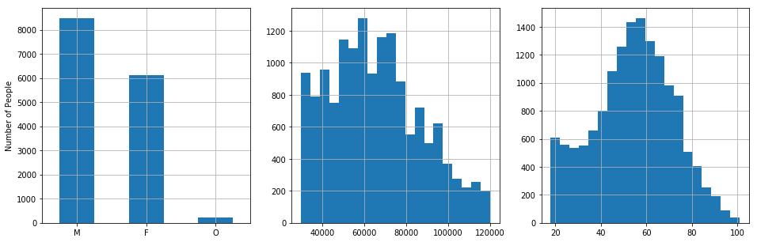
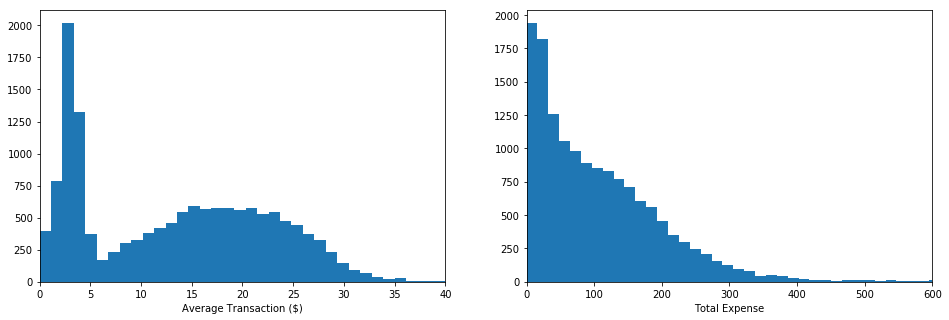
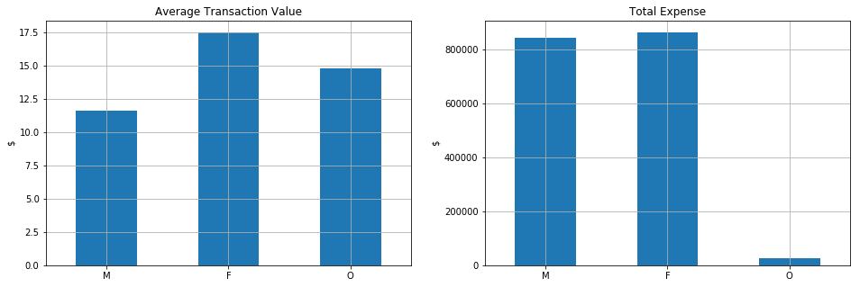
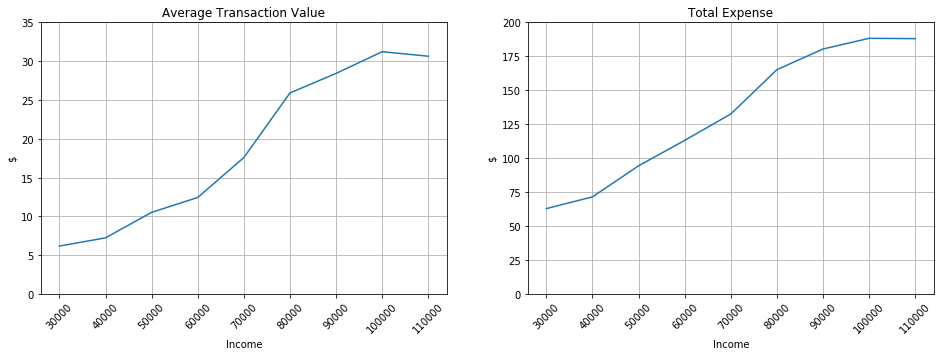
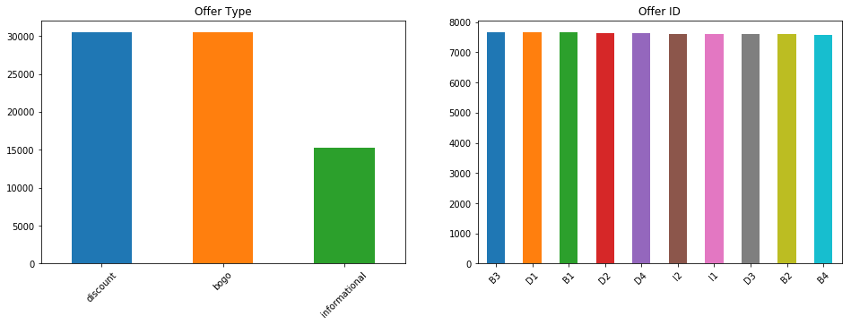

# Starbucks Capstone Challenge

## Introduction

Starbucks has provided a dataset that emulates the behavior of
customers using the Starbucks rewards mobile app. The Starbucks app
provides a way to adverstise and share offers with the
customers. Customers can also use it to pay at the stores. Starbucks
sends different types of advertisement and offers once every few days to their
customers. A customer might get one of the following:

- Informational offer (i.e., mere advertisement)
- Discount offer
- Buy one get one free (BOGO) offer

Discount and BOGO offers have a challenge, that is, the customer must
make a minimum purchase before it can redeem the offer. Additionally,
each offer has an expiration date. In the case of the informational
offers, the expiration date is when the customer stop feeling the
influence of the advertisement.

The data provided includes the demographics of each customer, the app
activity of customers for a period of 30 days. It includes the
timestamps of when a custumer received, viewed and completed an offer,
when a purchase was done, and the amount of money spent.

## Problem Statement

The goal of sending advertisment and offers to customers is to
increase the customer purchases. However, it would be naive to send
all offers to all customers at the same time. The goal of the project
is to take advantage of the transactional and demographics data to
determine the offers that should be targeted to different groups of
customers.

## Datasets

The following data files have been provided and included in the project's [repo](https://github.com/aproano2/starbucks)

- `portfolio.json` contains the details of each offer: duration, reward, type, etc
- `profile.json` contains demographic information of customer
- `transcript.json` contains all customers activity: transactions, offers received, offers viewed, and offers completed.

The datasets were cleaned and merged in a way that each row includes
customers activity, customers demographics and offers metadata.

## Data Analysis

### Population

From the datasets, we first note that the simulated data was obtained
for a period of 29.75 days, with 306,534 events. Each event represents
a transaction, an offer received, an offer viewed, or an offer
completed.

The figure shows the distribution of the population based on gender,
income and age. We note that around 8,500 customers are male, 6,100
are female and around 200 belong to other gender. In the case of the
income, we observe that curve roughly approches a normal curve with a
mean around 65,000 and a standard deviation of 21,000. Finally, the
age also seems to approach a normal distribution. It is truncrated on
the left side of the curve due to the fact that a customer must be 18
years or older to be part of the Starbucks program. The mean of the
age is 54 years and the standard deviation is 17.

### Expense

Now, we observe that the average expense of a single transaction
follows a bimodal distribution. The first lobe is centered around $2.5
and the second one around $18. In the case of the distribution of the
total expense done by a customer the values seems to decrease
exponentially.

When separating the data based on gender, we note that the women make
average purchases of $17.5, others of $15 and men of $12. However, we
also note that the total amount of money spent by men and women is
similar (~85,000) while others spend a fraction of that. This is
distributions are directly affected by the number of members of each
gender group.

In the case of the average transaction and the total expense, we see
that the values increase as the income of the customer increases,
which is expected. People that make less than $30,000 have an average
transaction of $6 while people making more than $90,000 have
transactions of more than $25. In the case of the total expense, the
values go from $60 to $180 in the same range of income.

As in the case of income, the spending behavior is similar with
age. As the value of age increases so do the average transaction and
the total expense values. The average transaction value goes from a value of
$8 for people under 20 to a value of $17 for people above
55. Similarly, the total expense goes from $80 in a month to almost
$140.

### Offers

The figure above shows the distribution of offers received by
customers. We note that each 30,000 discount and bogo offers have been
received, and 15,000 informational ones. The latter offer is half of
the others since there are only two informational offer and there are
four discount and four bogo. Moreover, we note that each offer has
been received by around 7,600 customers. This detail is important
since the simulated data does not have any bias towards an specific
offer, each customer has the same changes of receiving any offer.

## Offer Recommendation